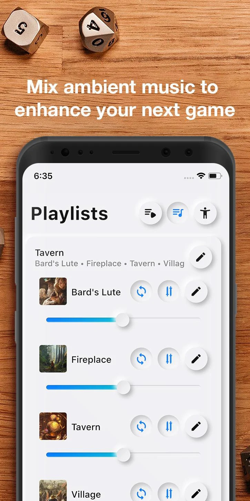

# Rolify

Rolify is an app that allows you to play multiple sounds simultaneously, with the ability to manage audio individually. You can also add the music you have on your phone, all completely offline and free.

| Android | Official SubReddit |
|:-:|:-:|
|  |  |

## Some background

Rolify was created for my Dungeons & Dragons sessions. My DM friend needed to create perfect settings for his adventures, and asked me an app that would allow him to combine the music of a bard with the sounds of a tavern, or the sound of leaves moving in the wind with the sound of a bonfire.

If you also had this need, you know that there is not much on the Play Store...

Most apps allow only one sound at a time, or they are not looped, or you have to pay for them.

I think this app will make many DM's dreams come true!

## Make it yours

Over the years I have received many requests for new features and I cannot manage them all by myself. For this reason I have long since abandoned the project. Nonetheless, interest in the app has never disappeared, and that's why I can't let this project die.

I tried my best to improve the code to make it easier for everyone to contribute, but I was faced with a personal project that I didn't expect to garner such interest. This means rushed code and zero documentation.

To make it open source I updated flutter to the latest version, switched to null safety, upgraded all packages, and worked on some old required features, but the code is far from perfect. I will be happy to help anyone who would like to participate, by taking a tour of the code or pointing out where to look.